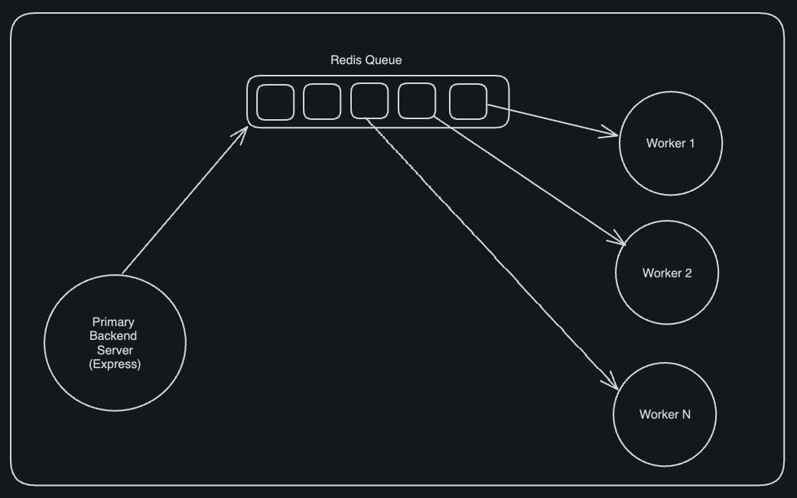

### Advanced Backend Boiler plate  

This is a boilerplate for the following:

- Primary Backend Server with ExpressJS
- A Redis Queue
- A NodeJs worker for performing Async Tasks.

### What's not included

- A database setup
- Websockets
- Pub/Sub


### Setup

#### express-server
```bash
cd backend-server
npm install
npm run dev
```

#### worker

```bash
cd worker
npm install
npm run dev
```

### Postman

```bash 
POST http://localhost:3000/submit
{
    "problemId": "1", 
    "userId": "2", 
    "code": "3", 
    "language": "4"
}
```

### Architecture

